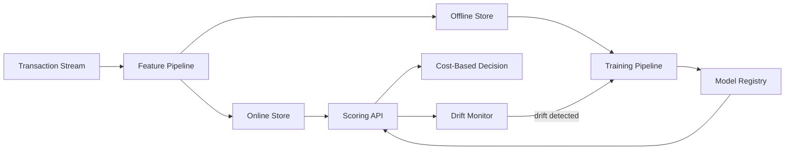

# Tripwire

A real-time transaction fraud & anomaly detection platform. A production-style ML system that scores financial transactions for fraud risk in real time, monitors itself for drift, and retrains automatically when its performance degrades. Built to demonstrate the full lifecycle of a fraud model in production — not just a trained classifier, but the ingestion, serving, monitoring, and retraining infrastructure around it.

> 📄 See [`docs/PRD.md`](docs/PRD.md) for the full product requirements and [`docs/ARCHITECTURE.md`](docs/ARCHITECTURE.md) for system design details.

---

## Why This Project Exists

Most fraud-detection portfolio projects stop at "I trained a classifier on an imbalanced dataset." That's the easy 20%. The hard 80% — and the part that actually matters in production — is:

- Making decisions in **under 100ms**
- Keeping **online and offline features identical** (train/serve skew is the #1 cause of ML production failures)
- Handling **labels that arrive weeks after the transaction**
- Detecting when the model has gone stale **before** it silently costs the business money
- Choosing a decision threshold based on **actual dollar cost**, not abstract accuracy metrics

This repo implements all of the above end-to-end.

## Architecture at a Glance



Full diagram and component-level detail in [`docs/ARCHITECTURE.md`](docs/ARCHITECTURE.md).

## Key Features

- ⚡ **Real-time scoring** — FastAPI service, p99 latency target < 100ms
- 🔁 **Train/serve parity** — single feature-definition layer, validated by automated parity tests
- 📉 **Drift detection** — PSI/KL-based monitoring on features and predictions, with automated retraining triggers
- ⏳ **Delayed-feedback training loop** — correctly handles labels that arrive days/weeks after scoring, without leakage
- 💰 **Cost-based decisioning** — thresholds chosen from a business cost function (fraud loss vs. customer friction), not a default cutoff
- 📊 **Full observability** — Grafana dashboards for latency, throughput, prediction drift, and rolling precision/recall

## Tech Stack

| Layer | Technology |
| ----- | ---------- |
| Streaming | Kafka / Redpanda |
| Feature store | Feast (or hand-rolled equivalent) |
| Modeling | LightGBM / XGBoost (baseline), Transformer/GRU (sequence model) |
| Serving | FastAPI + ONNX Runtime |
| Orchestration | Airflow / Dagster / Prefect |
| Monitoring | Prometheus + Grafana |
| Language | Python 3.11+ |

## Project Status

🚧 In active development. See milestones in [`docs/PRD.md`](docs/PRD.md#9-milestones).

| Milestone | Status |
| --------- | ------ |
| M1 — Offline baseline | ✅ Done |
| M2 — Serving path | ⬜ Not started |
| M3 — Streaming + shadow deploy | ⬜ Not started |
| M4 — Drift + retraining loop | ⬜ Not started |
| M5 — Dashboard + write-up | ⬜ Not started |

## Getting Started

### Prerequisites

- Python 3.11+
- Docker (for Kafka/Redpanda, Redis, Prometheus/Grafana locally)
- `uv` (or `poetry`) for dependency management

### Setup

```bash
git clone <repo-url>
cd tripwire
uv sync                      # installs dependencies from pyproject.toml
cp .env.example .env         # fill in local config
docker compose up -d         # starts Kafka/Redpanda, Redis, Prometheus, Grafana
```

### Running Tests

```bash
pytest tests/unit
pytest tests/feature_parity   # critical: online/offline feature equivalence
pytest tests/integration
```

### Running the Scoring Service Locally

```bash
uvicorn src.serving.app:app --reload --port 8000
```

## Project Structure

```text
tripwire/
├── src/
│   ├── ingestion/       # Kafka producers/consumers, event schemas
│   ├── features/        # Shared online/offline feature definitions
│   ├── models/          # Training code, model architectures
│   ├── serving/          # FastAPI app, inference, decision engine
│   ├── monitoring/       # Drift detection, metrics emitters
│   └── pipelines/        # Training/retraining orchestration
├── tests/
├── configs/
├── docs/
│   ├── PRD.md
│   ├── ARCHITECTURE.md
│   ├── CODING_STANDARDS.md
│   └── TESTING_STRATEGY.md
├── notebooks/            # Exploration only, no production logic
└── scripts/
```

## Documentation Index

| Doc | Purpose |
| --- | ------- |
| [PRD.md](docs/PRD.md) | Product requirements, goals, scope |
| [ARCHITECTURE.md](docs/ARCHITECTURE.md) | System design, data flow, tradeoffs |
| [CODING_STANDARDS.md](docs/CODING_STANDARDS.md) | Style, testing, and review conventions |
| [TESTING_STRATEGY.md](docs/TESTING_STRATEGY.md) | Test categories and what each protects against |
| [API_SPEC.md](docs/API_SPEC.md) | Scoring API request/response contract |
| [CONTRIBUTING.md](CONTRIBUTING.md) | How to contribute, branch/PR conventions |
| [CLAUDE.md](CLAUDE.md) | Guidance for AI coding assistants working in this repo |

## Data

Uses public datasets only — [IEEE-CIS Fraud Detection](https://www.kaggle.com/c/ieee-fraud-detection) and/or [PaySim synthetic mobile money data](https://www.kaggle.com/datasets/ealaxi/paysim1). No real PII/PCI data is used anywhere in this project.

## License

MIT — see [LICENSE](LICENSE).

## Author

Chitresh Gyanani. See [PRD.md](docs/PRD.md) for full scope.
