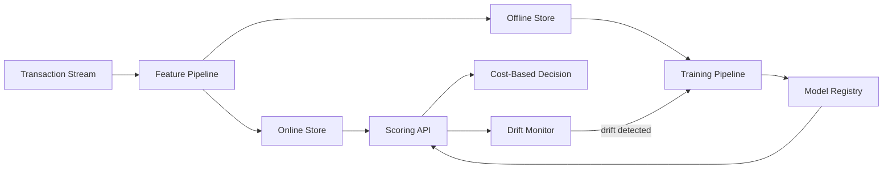

# Tripwire

[](https://github.com/Chitresh-code/tripwire/actions/workflows/ci.yml)

A real-time transaction fraud detection platform: transaction events → shared feature pipeline → scoring API → cost-based decision, with automated drift detection and retraining behind it.

> See [`docs/PRD.md`](docs/PRD.md) for the full product requirements and [`docs/ARCHITECTURE.md`](docs/ARCHITECTURE.md) for system design.

---

## What it does

- **Scores transactions in real time** via a FastAPI endpoint, with a p99 latency budget of 100ms.
- **Uses one feature-definition layer for both training and serving**, checked by automated parity tests — the #1 cause of ML production failures is a feature computed one way offline and a different way online.
- **Decides using a cost function**, not a fixed threshold — the cutoff is chosen from actual fraud-loss vs. customer-friction dollar costs (`src/serving/decision_engine.py`), not an arbitrary 0.5.
- **Watches itself for drift** (PSI/KL on features and predictions) and can trigger an automated retrain, complete with a shadow-mode comparison before a new model takes over production traffic.
- **Handles labels that arrive late** — fraud isn't confirmed the moment it happens, so the training pipeline can filter out rows whose labels weren't actually available yet at scoring time, avoiding leakage.
- **Explains its own scores** — every response includes the top contributing features (LightGBM's exact SHAP-style attribution), not just a bare probability.

## Architecture


```mermaid
flowchart LR
    A[Transaction Stream] --> B[Feature Pipeline]
    B --> C[Online Store]
    B --> D[Offline Store]
    C --> E[Scoring API]
    E --> F[Cost-Based Decision]
    D --> G[Training Pipeline]
    G --> H[Model Registry]
    H --> E
    E --> I[Drift Monitor]
    I -->|drift detected| G
```

Full diagram and component-level detail in [`docs/ARCHITECTURE.md`](docs/ARCHITECTURE.md).

## Tech stack

| Layer | Technology |
| ----- | ---------- |
| Streaming | Redpanda (Kafka API) |
| Feature store | Hand-rolled (`src/features/`) — same code path for training and serving |
| Modeling | LightGBM (baseline), GRU (sequence model) |
| Serving | FastAPI |
| Monitoring | Prometheus + Grafana |
| Model storage | S3-compatible object storage (AWS S3 / R2 / MinIO), fetched at container startup |
| Language | Python 3.11+ |

## Project status

See milestones in [`docs/PRD.md`](docs/PRD.md#9-milestones).

| Milestone | Status |
| --------- | ------ |
| M1 — Offline baseline | ✅ Done |
| M2 — Serving path | ✅ Done |
| M3 — Streaming + shadow deploy | ✅ Done |
| M4 — Drift + retraining loop | ✅ Done |
| M5 — Dashboard + write-up | ✅ Done |
| M6 — Explainability | ✅ Done |
| M7 — Rules-only baseline | ✅ Done |
| M8 — Sequence model | ✅ Done (doesn't beat the GBT baseline — see `docs/DECISIONS.md`) |
| M9 — Delayed-feedback loop | ✅ Done (demo path, not wired into the default retrain — see `docs/DECISIONS.md`) |
| M10 — Canary rollout | ⬜ Not started |

## Getting started

### Prerequisites

- Python 3.11+
- [`uv`](https://docs.astral.sh/uv/) for dependency management
- Docker, for the local Redpanda/Prometheus/Grafana stack (not required to run the API itself)

### Setup

```bash
git clone https://github.com/Chitresh-code/tripwire.git
cd tripwire
uv sync                      # installs dependencies from pyproject.toml
cp .env.example .env         # fill in local config
docker compose up -d         # starts Redpanda, Prometheus, Grafana
```

### Running the tests

```bash
pytest                        # everything
pytest tests/feature_parity   # critical: online/offline feature equivalence
pytest tests/leakage          # label-availability / leakage checks
```

### Running the API locally

```bash
uvicorn src.serving.app:app --reload --port 8000
curl localhost:8000/v1/health
```

## Deployment

The API is containerized (`Dockerfile`, runs as a non-root user). The model registry is fetched from object storage at container startup rather than baked into the image, so publishing a new model + restarting the container is enough to deploy it — no image rebuild.

```bash
docker build -t tripwire-api .
```

**Giving the container a model** — two options:

1. **Local volume mount** (testing/demo, no object storage needed):
   ```bash
   docker run -p 8000:8000 -v $(pwd)/models/registry:/app/models/registry tripwire-api
   ```
2. **Object storage** (real deployment): set `model_bucket` (and, for a non-AWS provider like Cloudflare R2 or MinIO, `endpoint_url`) in `configs/deployment.yaml`, run `uv run python scripts/publish_model.py` to upload your local registry, then start the container with credentials in the environment:
   ```bash
   docker run -p 8000:8000 \
     -e AWS_ACCESS_KEY_ID=... \
     -e AWS_SECRET_ACCESS_KEY=... \
     tripwire-api
   ```
   Credentials are never read from `configs/*.yaml` — only the bucket name and endpoint are. Leaving `model_bucket` empty (the default) disables object storage entirely; the container then expects a mounted `models/registry/` as in option 1.

The image includes a `HEALTHCHECK` against `/v1/health`. Every push/PR to `main` runs `pytest`, `ruff`, `mypy --strict`, and `black --check` via GitHub Actions.

## Project structure

```text
tripwire/
├── src/
│   ├── ingestion/       # Kafka/Redpanda producers/consumers, event schemas
│   ├── features/        # Shared online/offline feature definitions
│   ├── models/          # Training code, model architectures, registry
│   ├── serving/         # FastAPI app, inference, decision engine
│   ├── monitoring/      # Drift detection, metrics
│   └── pipelines/       # Training/retraining orchestration
├── tests/
├── configs/
├── docs/
├── notebooks/            # Exploration only, no production logic
└── scripts/
```

## Documentation

| Doc | Purpose |
| --- | ------- |
| [PRD.md](docs/PRD.md) | Product requirements, goals, scope |
| [ARCHITECTURE.md](docs/ARCHITECTURE.md) | System design, data flow, tradeoffs |
| [CODING_STANDARDS.md](docs/CODING_STANDARDS.md) | Style, testing, and review conventions |
| [TESTING_STRATEGY.md](docs/TESTING_STRATEGY.md) | Test categories and what each protects against |
| [API_SPEC.md](docs/API_SPEC.md) | Scoring API request/response contract |
| [DECISIONS.md](docs/DECISIONS.md) | Log of real findings and tradeoffs made along the way |
| [CONTRIBUTING.md](CONTRIBUTING.md) | How to contribute, branch/PR conventions |

## Data

Uses public datasets only — [IEEE-CIS Fraud Detection](https://www.kaggle.com/c/ieee-fraud-detection) and/or [PaySim synthetic mobile money data](https://www.kaggle.com/datasets/ealaxi/paysim1). No real PII/PCI data is used anywhere in this project.

## License

Apache 2.0 — see [LICENSE](LICENSE).

## Author

Chitresh Gyanani. See [PRD.md](docs/PRD.md) for full scope.
