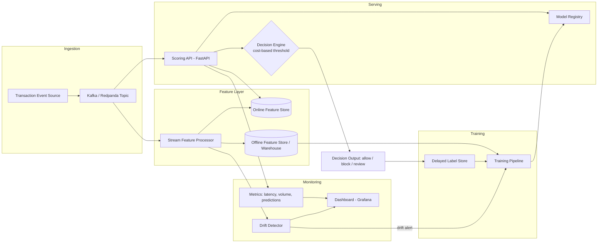

# Architecture & Design Document

## Tripwire — Real-Time Transaction Fraud & Anomaly Detection Platform

**Version:** 1.0
**Status:** Living document — update alongside any architectural change

---

## 1. System Overview

This platform ingests transaction events, scores them for fraud risk in real time, and continuously monitors itself for data/model drift, triggering retraining when needed. It is designed around one core principle:

> **The hard part of fraud detection isn't the model — it's everything around the model.** Feature parity between training and serving, delayed labels, drift, and cost-sensitive decisions are the actual engineering problems.

### 1.1 High-Level Architecture

### 1.2 Design Principles

1. **Train/serve parity is a first-class requirement, not an afterthought.** Every feature has a single definition used identically online and offline.
2. **The model is not the product; the decision is.** Thresholds are chosen by an explicit cost function, not a default probability cutoff.
3. **Assume drift will happen.** The system is built to detect its own staleness and respond, not just to score well on a static test set.
4. **Labels lie about when they happened.** Delayed feedback is modeled explicitly rather than pretending labels arrive instantly.
5. **Every production decision is auditable.** Model version, feature values, and threshold used must be reconstructable after the fact.

---

## 2. Component Breakdown

### 2.1 Ingestion Layer
- **Responsibility:** Accept transaction events and publish them onto a durable stream.
- **Technology:** Kafka or Redpanda (Redpanda preferred for local dev — lighter weight, Kafka-API compatible).
- **Why a stream and not a direct API call to the model:** decouples ingestion rate from processing rate, allows replay for debugging/backtesting, and is the realistic pattern used by actual payment processors.

### 2.2 Feature Layer
- **Responsibility:** Compute features from raw events and make them available identically to both the training pipeline (offline) and the serving path (online, low latency).
- **Two feature types:**
  - *Point-in-time features* (transaction amount, merchant category, time of day) — stateless, computed directly from the event.
  - *Windowed/aggregated features* (e.g., "number of transactions on this card in the last 10 minutes") — stateful, require a low-latency lookup.
- **Design decision:** a single feature-definition layer (e.g., using a lightweight feature-store pattern, whether a real tool like Feast or a hand-rolled equivalent) generates both the online values (served from a fast KV store like Redis) and the offline training values (materialized to the warehouse/parquet). This is the single most important design decision in the system — **skew here silently destroys model performance in production while looking fine in offline eval.**
- **Parity validation:** an automated test recomputes a sample of online features in the offline pipeline and asserts equivalence on every deploy.

### 2.3 Serving Layer
- **Responsibility:** Score incoming transactions within the latency budget and apply a cost-based decision.
- **Technology:** FastAPI service, model loaded via ONNX Runtime (or native framework runtime) for low-latency inference.
- **Latency budget (target p99 < 100ms):**

| Stage | Budget |
|---|---|
| Feature lookup (online store) | ~20ms |
| Model inference | ~30ms |
| Decision logic + response serialization | ~10ms |
| Network/framework overhead | ~40ms (buffer) |

- **Decision Engine:** converts a raw probability into an `allow / block / review` decision using a cost matrix (expected fraud loss vs. expected customer-friction cost), not a fixed 0.5 threshold. Threshold is a configurable, versioned artifact — not hardcoded.
- **Deployment patterns supported:**
  - *Shadow mode:* new model scores traffic silently; predictions logged but not acted on.
  - *Canary rollout:* gradual traffic ramp (5% → 25% → 100%) with automatic rollback if error rate or latency budget is breached.

### 2.4 Training Pipeline
- **Responsibility:** Produce a new model artifact from offline features + labels, on a schedule or triggered by drift.
- **Handling delayed labels:** transactions are scored at time T, but their true label (fraud/not fraud) may not be confirmed until T+N days. The training pipeline joins labels back to the **original feature snapshot** taken at scoring time (not recomputed at label-arrival time), to avoid leaking future information into training data.
- **Orchestration:** Airflow/Dagster/Prefect DAG — stages: extract features + delayed labels → validate data quality → train candidate model → offline evaluate → compare vs. current production model → register if improved.

### 2.5 Drift Detection & Retraining Loop
- **Responsibility:** Detect when the production model's input distribution or prediction distribution has shifted meaningfully, and trigger retraining.
- **Metrics used:** Population Stability Index (PSI) or KL divergence on key features and on the prediction score distribution, computed on a rolling window and compared to a reference (training-time) distribution.
- **Loop:** drift metric exceeds threshold → alert fired → automated retraining job triggered → new candidate evaluated offline → if it passes evaluation gates, deployed via shadow mode first, then canary.

### 2.6 Monitoring & Observability
- **Responsibility:** Give visibility into both system health (latency, throughput, error rate) and model health (prediction distribution, drift metric, proxy precision/recall as delayed labels arrive).
- **Technology:** Prometheus for metrics collection, Grafana for dashboards.
- **Key dashboards:**
  1. Latency (p50/p95/p99) and throughput over time.
  2. Prediction score distribution over time (visual drift check).
  3. Drift metric (PSI) per feature over time, with alert thresholds marked.
  4. Rolling precision/recall proxy, updated as delayed labels arrive.

---

## 3. Data Flow Summary

1. Transaction event → Kafka topic.
2. Stream processor computes features → writes to online store (serving) and offline store (training/analytics).
3. Scoring API reads online features → runs inference → applies cost-based decision → returns decision, logs everything (features used, model version, score, decision).
4. Decision + eventual delayed label → joined and stored for retraining.
5. Drift detector continuously compares live feature/prediction distributions to reference distributions.
6. On drift or schedule, training pipeline runs, evaluates, and — if it clears evaluation gates — is deployed via shadow → canary → full rollout.

---

## 4. Key Design Tradeoffs

| Decision | Alternative Considered | Why This Choice |
|---|---|---|
| Cost-based threshold vs. fixed probability cutoff | Standard 0.5 cutoff or F1-optimized threshold | Business impact is asymmetric (fraud loss ≠ friction cost); a threshold tuned on abstract metrics doesn't reflect actual $ tradeoffs |
| Delayed-feedback label join at scoring-time snapshot vs. recompute at label arrival | Recompute features at label-arrival time | Recomputing at label time leaks future information into training data (subtle but serious leakage bug) |
| Shadow deploy before canary | Direct canary rollout | Shadow mode validates the new model against real traffic with zero customer risk before any live decisions are affected |
| Single feature-definition layer for online+offline | Separate online/offline feature code paths | Separate code paths are the single most common cause of production ML failures (train/serve skew); worth the upfront engineering cost to avoid |
| GBT baseline + sequence model comparison | Sequence model only | Establishes whether the added complexity of a sequence model is actually justified by measurable lift — avoids complexity for its own sake |

---

## 5. Failure Modes & Mitigations

| Failure Mode | Detection | Mitigation |
|---|---|---|
| Feature store returns stale/missing values | Online feature freshness check on read | Fallback to default/backup feature values; alert; degrade gracefully rather than fail the request |
| Model drift undetected | Rolling PSI/KL monitoring | Automated alert + retrain trigger; documented alert threshold tuning |
| Bad model deployed | Offline evaluation gate + shadow mode comparison | Deployment blocked unless candidate model clears defined evaluation thresholds vs. current production model |
| Canary regression in production | Real-time latency/error-rate monitoring during rollout | Automatic rollback if thresholds breached during ramp |
| Label leakage in training data | Code review + automated data validation checks | Explicit point-in-time join logic, tested with unit tests using synthetic time-shifted data |

---

## 6. Scalability Notes

This project is built to demonstrate the **architecture pattern**, not to handle hyperscale traffic. The design choices (streaming ingestion, separate online/offline stores, horizontally-scalable stateless scoring service) are the same ones used at scale in real systems — the honest scope here is a single-node/small-cluster deployment that proves the pattern works correctly, with a documented discussion (in the README) of what would change at 100x traffic (e.g., feature store sharding, model serving autoscaling, partitioned Kafka topics).

---

## 7. Security & Compliance Notes

- All data used is public/synthetic (IEEE-CIS or PaySim datasets) — no real PII or PCI data is processed.
- If extended with real data in the future, this design would require: encryption at rest/in transit, PCI-DSS-aware handling of cardholder data, and strict access controls on the feature store — noted here for completeness even though out of scope for now.