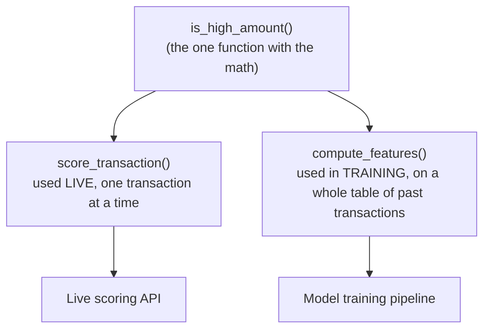
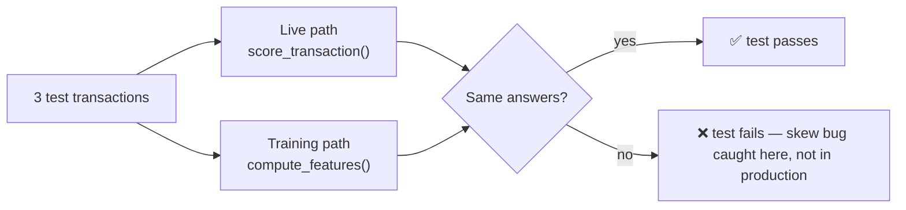

# 01 — Setting up the project and building our very first "feature"

This is the first piece of real code in Tripwire. This doc explains, in plain language, what we built and why.

## What is a "feature" in this project?

Not "feature" like a product feature. Here it means: **one small fact we calculate about a transaction**, that we later feed into the fraud-detection model. Think of it like a single column in a spreadsheet: "Was this transaction over $500? Yes or No."

We built the simplest possible one: `is_high_amount` — is the transaction amount $500 or more?

## The one big rule of this whole project

Tripwire has to score transactions **twice**, in two very different places:

1. **Live, in production** — the instant someone swipes their card, we compute features for *that one transaction* and decide fraud or not, in under 100 milliseconds.
2. **During training** — months later, we compute the *same* features for millions of old transactions to teach the model what fraud looks like.

If those two places calculate `is_high_amount` even slightly differently, the model trains on one reality and gets used in another. This is called **train/serve skew**, and it's one of the most common ways real fraud-detection systems silently break.

**The fix: write the math exactly once, and call that one function from both places.**



Both `score_transaction` (live) and `compute_features` (training) call `is_high_amount` underneath. Neither one has its own copy of the "$500" logic — there is only one copy, in one place.

## Where the code lives

| File | What it does |
| --- | --- |
| `configs/features.yaml` | Holds the number `500.0`. Not buried in code — see below. |
| `src/config.py` | Reads `configs/features.yaml` into a typed Python object. |
| `src/features/amount_features.py` | The actual feature: `is_high_amount`, plus the live and training wrappers. |
| `tests/feature_parity/test_amount_features.py` | Proves the live path and the training path give identical answers. |

## Why is the `$500` in a YAML file instead of the code?

Imagine "block anything over $500" is a business decision, not a programming decision. A risk analyst might want to change it to $750 next month. If that number is buried inside a Python function, changing it means editing code and redeploying. If it lives in `configs/features.yaml`, it's just:

```yaml
high_amount_threshold: 500.0
```

...a one-line edit, no code change needed. This is a rule for the whole project (see `AGENTs.md`): **no hardcoded numbers in code, they live in config files.**

## The "parity test" — how we prove both paths agree

`tests/feature_parity/test_amount_features.py` does this:

1. Makes up 3 fake transactions: `$10`, `$500`, `$999.99`.
2. Runs them through the **live** path (`score_transaction`, one at a time — like a real API call would).
3. Runs the exact same 3 transactions through the **training** path (`compute_features`, all at once as a table).
4. Checks the answers are identical.



This test is what would catch it *immediately* — in a few milliseconds, on your laptop — instead of the mismatch only showing up as "why is the model performing worse in production than in training?" weeks later.

## How to run it yourself

```bash
uv run pytest tests/feature_parity -v   # run the parity test
uv run ruff check src/ tests/           # style/lint check
uv run mypy src/ --strict               # type check
```

All three currently pass.

## What's deliberately NOT here yet

- No real dataset yet — just made-up test transactions.
- No model — this is only the *feature*, not the fraud prediction.
- No live API — `score_transaction` exists but nothing calls it over HTTP yet (that's milestone M2).

Small on purpose, so the pattern (one function, two callers, one test proving they match) is easy to see before we add more features on top of it.
